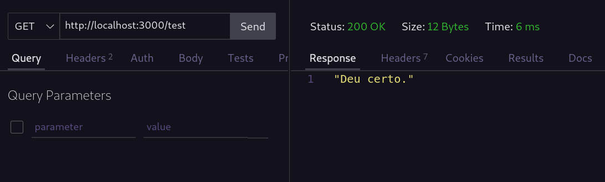

# Estrutura básica API

## Repositório utilitário com a estrutura básica para a criação de uma API simples

Este repositório contém o código da estrutura básica para o desenvolvimento de uma API que utiliza Express e Node js para se comunicar e realizar requisições com um banco de dados sqlite3.

Para executar este projeto execute no terminal:

```bash
npm start
```

## Testando rotas da API

Caso deseje realizar testes de requisição, uma sugestão é instalar a extensão [Thunder Client](https://marketplace.visualstudio.com/items?itemName=rangav.vscode-thunder-client) do vsCode, ele permite que você possa realizar requisições mais facilmente e testar as suas rotas.

A response da requisição é exibida ao lado direito da janela, junto com outras informações.


